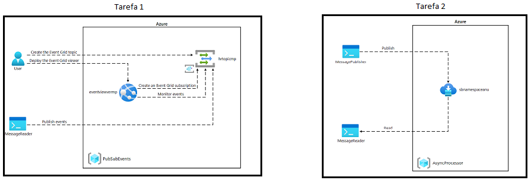
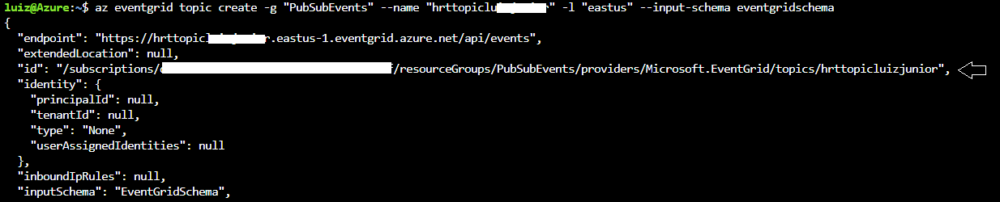
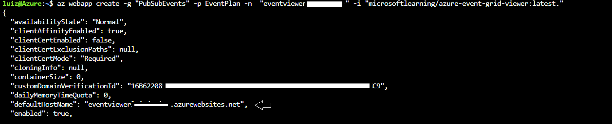
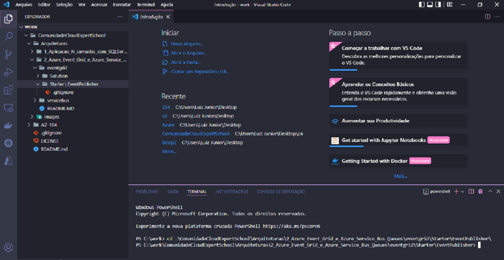
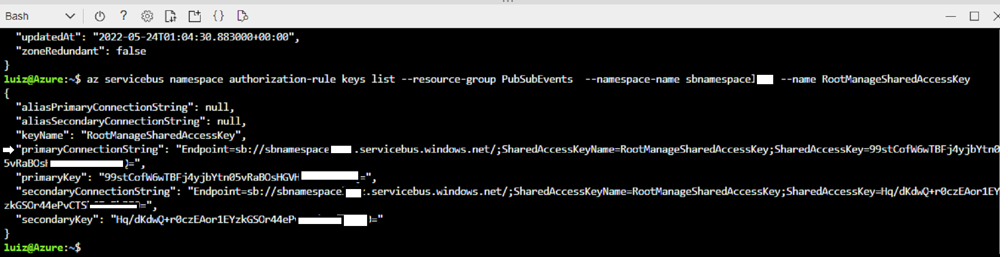
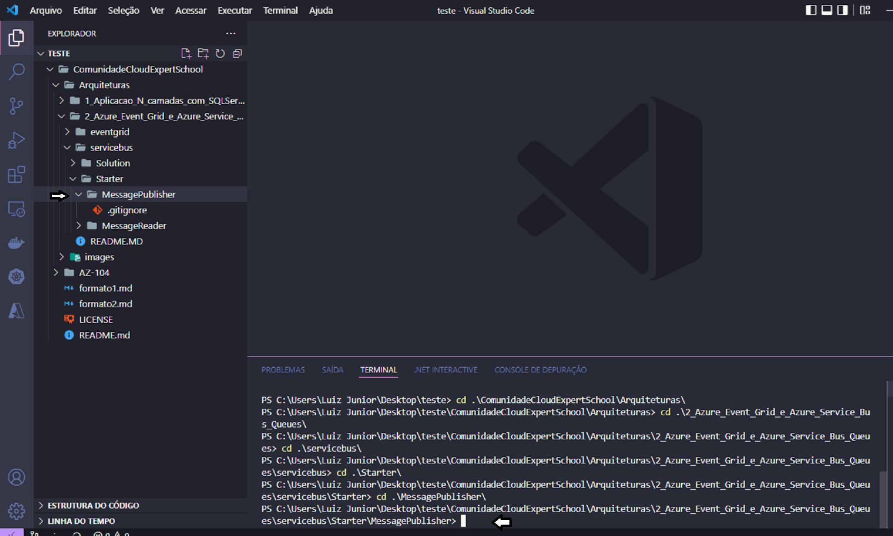

# Lab 2 - Publicar_e_assinar_eventos_do_Event_Grid_e processar_mensagens_de_forma_assíncrona_usando_o_Azure_Service_Bus_Queues


## Diagrama de Arquitetura




## Tarefa 1

#### Passo 1: Abra o portal do Azure

1. Abra seu navegador.

2. Na janela do navegador aberta, navegue até o portal do Azure (<https://portal.azure.com>), e entre com a conta que você usará para este laboratório.

    > **Observação**: se esta for a primeira vez que você entra no portal do Azure, será oferecido um tour pelo portal. Selecione **Começar** para pular o tour e começar a usar o portal.

#### Passo 2: Abra o Azure Cloud Shell

 1. No portal do Azure, selecione o ícone do **Cloud Shell**  para abrir uma nova sessão do Bash. Se o padrão do Cloud Shell for uma sessão do PowerShell, selecione **PowerShell** e, no menu suspenso, selecione **Bash** .

    > **Observação**: se esta for a primeira vez que você está iniciando o **Cloud Shell** , quando solicitado a selecionar **Bash** ou **PowerShell** , selecione **Bash** . Quando você receber a mensagem Você não tem armazenamento montado , selecione a assinatura que você está usando neste laboratório e, em seguida, selecione Criar armazenamento .

 2. No portal do Azure, no prompt de comando do **Cloud Shell** , execute o seguinte comando para obter a versão da ferramenta Azure Command-Line Interface (Azure CLI):

    ```bash
    az --version
    ```

#### Passo 3: Revise o registro do provedor Microsoft.EventGrid

1. No **painel CLoud Shell**, execute o seguinte comando para obter uma lista de subgrupos e comandos no nível raiz da CLI do Azure:

    ```bash
    az --help
    ```

2. No **painel CLoud Shell**, execute o seguinte comando para obter uma lista dos comandos disponíveis para provedores de recursos:

    ```bash
    az provider --help
    ```

3. No **painel CLoud Shell**, execute o seguinte comando para listar todos os provedores registrados atualmente:

    ```bash
    az provider list
    ```

4. No **painel CLoud Shell**, execute o seguinte comando para listar apenas os namespaces dos provedores registrados no momento:

    ```bash
    az provider list --query "[].namespace"
    ```

5. No **painel CLoud Shell**, revise a lista de provedores registrados no momento. Observe que o provedor **Microsoft.EventGrid** está atualmente incluído na lista de provedores.

6. Feche o **painel Cloud Shell**.

#### Passo 4: Criar um tópico EventGrid personalizado
1. Criar Grupo de Recursos


    **Cloud Shell**

    ```bash
    az group create --name "PubSubEvents" --location "eastus"
    ```
2. Criar tópico do EventGrid

    **Cloud Shell**
    ```bash
    az eventgrid topic create -g "PubSubEvents" --name "hrttopic<yourname>" -l "eastus" --public-network-access enabled 
    ```

    Capture o valor do id do recurso como mostra a figura abaixo. Você usará esse valor posteriormente no laboratório.


    

3. Criar Plano de Serviço de Aplicativo

    **Cloud Shell**
    ```bash
    az appservice plan create -g "PubSubEvents" -n EventPlan --is-linux --sku P1v2
    ```
3. Criar Aplicativo Web

    **Cloud Shell**
    ```bash
    az webapp create -g "PubSubEvents" -p EventPlan -n "eventviewer<yourname>" -i microsoftlearning/azure-event-grid-viewer:latest
    ```
    > **Observação**: Aguarde o Azure concluir a criação do aplicativo Web antes de continuar com o laboratório.

    Capture o valor do link da URL como mostra a figura abaixo. Você usará esse valor posteriormente no laboratório.

    

#### Passo 5: Criar uma assinatura do Event Grid

**Cloud Shell**
```bash
    az eventgrid event-subscription create --name "basicsub" --source-resource-id "/subscriptions/<subscriptionID>/resourceGroups/PubSubEvents/providers/Microsoft.EventGrid/topics/hrttopic<yourname>" --endpoint "https://eventviewer<yourname>.azurewebsites.net/api/updates" --endpoint-type "webhook" 
```

+ No parâmetro **--source-resource-id** , insira o valor do ID do tópico do EventGrid que você guardou anteriormente.
    
+ No parâmetro **endpoint** , insira o valor de URL do aplicativo Web que você guardou anteriormente, certifique-se de que ele usa um prefixo https:// , e adicione o sufixo /api/updates. Por exemplo, se o valor da URL do seu aplicativo Web for http://eventviewerstudent.azurewebsites.net/, seu endpoint será https://eventviewerstudent.azurewebsites.net/api/updates.
    
#### Passo 6: Guarde as credenciais da assinatura

1. No painel de navegação do portal do Azure, selecione **Resource groups**.

2. Na folha **Resource groups**, selecione o grupo de recursos **PubSubEvents** que você criou anteriormente neste laboratório.

3. Na folha **PubSubEvents**, selecione o tópico Event Grid  **hrtopic**_[yourname]_  que você criou anteriormente neste laboratório.

4. Na folha **Event Grid Topic**, guarde o valor do campo **Topic Endpoint**. Você usará esse valor posteriormente no laboratório.

5. Na categoria **Settings**, selecione o link **Access keys**.

6. Na seção **Access keys**, registre o valor da caixa de texto **Key 1**. Você usará esse valor posteriormente no laboratório.

#### Passo 7: Publicar eventos do Event Grid do .NET

_Crie um Projeto .NET_

1. Crie uma pasta em seu computador chamada **work** em C:

2. Abra o **Visual Studio Code** em seu computador, e abra a pasta.

3. Abra o powershell no VScode e faça git clone do projeto.

    ```
    git clone https://github.com/luizjrlopes/ComunidadeCloudExpertSchool.git 
    ```
4. Finalizado o git clone, no terminal, entre na pasta **EventPublisher** em _(..\eventgrid\Starter\EventPublisher\)_ como na figura abaixo.


    

5. Para rodar os comandos a seguir é necessário possuir o dotnet core 3.1. Caso não tenha instalado, baixe e instale a partir do link: [Download .NET Core 3.1](https://dotnet.microsoft.com/en-us/download/dotnet).

    >**Observação**: Caso tenha instalado o .NET 6.0 poderá haver erro devido a mudança de bibliotecas. Desistale e instale o .NET Core 3.1.

6. De volta ao terminal do VScode, rode o seguinte comando para criar um novo projeto .NET chamado **EventPublisher** na pasta atual:

    ```powershell
    dotnet new console --name EventPublisher --output .
    ```

    > **Observação**: o comando **dotnet new** criará um novo projeto de **console** em uma pasta com o mesmo nome do projeto.

7. Execute o seguinte comando para importar a versão 4.1.0 do **Azure.Messaging.EventGrid** do NuGet:

    ```powershell
    dotnet add package Azure.Messaging.EventGrid --version 4.1.0
    ```

    > **Observação**: o comando **dotnet add package** adicionará o pacote **Microsoft.Azure.EventGrid** do NuGet. Para mais informações, acesse [Azure.Messaging.EventGrid](https://www.nuget.org/packages/Azure.Messaging.EventGrid/4.1.0).

8. Execute o seguinte comando para compilar o aplicativo Web .NET:

    ```powershell
    dotnet build
    ```

9. Selecione **Kill Terminal** ou o ícone **Recycle Bin** para fechar o terminal atualmente aberto e quaisquer processos associados.

#### Passo 7: Modifique a classe Program para se conectar ao Event Grid

1. No painel **Explorer** da janela **Visual Studio Code**, abra o arquivo **Program.cs**.

2. Na guia do editor de código do arquivo **Program.cs** , exclua todo o código do arquivo existente.

3. Adicione a seguinte linha de código para importar os namespaces **Azure** e **Azure.Messaging.EventGrid** do pacote **Azure.Messaging.EventGrid** importado do NuGet:

    ```csharp
    using Azure;
    using Azure.Messaging.EventGrid;
    ```

4. Adicione as seguintes linhas de código para adicionar a diretiva **using** para os namespaces internos que serão usados ​​neste arquivo:

    ```csharp
    using System;
    using System.Threading.Tasks;
    ```

5. Digite o seguinte código para criar uma nova classe **Program**:

    ```csharp
    public class Program
    {
    }
    ```

6. Na classe **Program**, insira a seguinte linha de código para criar uma nova constante de string chamada **topicEndpoint**:

    ```csharp
    private const string topicEndpoint = "";
    ```

7. Atualize a constante de string **topicEndpoint** definindo seu valor para o **Topic Endpoint** do tópico Event Grid que você guardou anteriormente neste laboratório.

8. Na classe **Program**, insira a seguinte linha de código para criar uma nova constante de string chamada **topicKey**:

    ```csharp
    private const string topicKey = "";
    ```

9. Atualize a constante de string **topicKey** definindo seu valor como a **Key** do tópico Event Grid que você guardou anteriormente neste laboratório.

10. Na classe **Program**, insira o código a seguir para criar um novo método assíncrono **Main**:

    ```csharp
    public static async Task Main(string[] args)
    {
    }
    ```

11. O arquivo **Program.cs**, ao final deve possuir as seguintes linhas de código:

    ```csharp
    using System;
    using System.Threading.Tasks;
    using Azure;
    using Azure.Messaging.EventGrid;
    public class Program
    {
        private const string topicEndpoint = "<topic-endpoint>";
        private const string topicKey = "<topic-key>";
        public static async Task Main(string[] args)
        {
        }
    }
    ```

#### Passo 8: Publicar novos eventos

1. No método **Main**, execute as seguintes ações para publicar uma lista de eventos em seu **topic Endpoint**:

    a. Adicione a seguinte linha de código para criar uma nova variável chamada **endpoint** do tipo **Uri**, usando a constante string **topicEndpoint** como um parâmetro de construtor:

    ```csharp
    Uri endpoint = new Uri(topicEndpoint); 
    ```

    b. Adicione a seguinte linha de código para criar uma nova variável chamada **credential** do tipo **[AzureKeyCredential](https://docs.microsoft.com/dotnet/api/azure.azurekeycredential)**, usando a constante string **topicKey** como um parâmetro de construtor:

    ```csharp
    AzureKeyCredential credential = new AzureKeyCredential(topicKey);
    ```

    c. Adicione a seguinte linha de código para criar uma nova variável chamada **client** do tipo **[EventGridPublisherClient](https://docs.microsoft.com/dotnet/api/azure.messaging.eventgrid.eventgridpublisherclient)**, usando as variáveis ​​**endpoint** e **credential** como parâmetros do construtor:

    ```csharp
    EventGridPublisherClient client = new EventGridPublisherClient(endpoint, credential);
    ```

    d. Adicione o seguinte bloco de código para criar uma nova variável chamada **firstEvent** do tipo **[EventGridEvent](https://docs.microsoft.com/dotnet/api/azure.messaging.eventgrid.eventgridevent)** e preencha essa variável com dados de amostra:

    ```csharp
    EventGridEvent firstEvent = new EventGridEvent(
        subject: $"New Employee: Alba Sutton",
        eventType: "Employees.Registration.New",
        dataVersion: "1.0",
        data: new
        {
            FullName = "Alba Sutton",
            Address = "4567 Pine Avenue, Edison, WA 97202"
        }
    );
    ```

    e. Adicione o seguinte bloco de código para criar uma nova variável chamada **secondEvent** do tipo **[EventGridEvent](https://docs.microsoft.com/dotnet/api/azure.messaging.eventgrid.eventgridevent)** e preencha essa variável com dados de amostra:

    ```csharp
        EventGridEvent secondEvent = new EventGridEvent(
            subject: $"New Employee: Alexandre Doyon",
            eventType: "Employees.Registration.New",
            dataVersion: "1.0",
            data: new
            {
                FullName = "Alexandre Doyon",
                Address = "456 College Street, Bow, WA 98107"
            }
        );
    ```

    f. Adicione a seguinte linha de código para invocar de forma assíncrona o **[EventGridPublisherClient.SendEventAsync](https://docs.microsoft.com/dotnet/api/azure.messaging.eventgrid.eventgridpublisherclient.sendeventasync)** usando a variável **firstEvent** como parâmetro:

    ```csharp
    await client.SendEventAsync(firstEvent);
    ```

    g. Adicione a seguinte linha de código para renderizar a mensagem **"Primeiro evento publicado"** no console:

    ```csharp
    Console.WriteLine("Primeiro evento publicado");
    ```

    h. Adicione a seguinte linha de código para invocar de forma assíncrona o **[EventGridPublisherClient.SendEventAsync](https://docs.microsoft.com/dotnet/api/azure.messaging.eventgrid.eventgridpublisherclient.sendeventasync)** usando a variável **secondEvent** como parâmetro:

    ```csharp
    await client.SendEventAsync(secondEvent);
    ```

    i. Adicione a seguinte linha de código para renderizar a mensagem **"Segundo evento publicado"** no console:

    ```csharp
    Console.WriteLine("Segundo evento publicado");
    ```

1. Revise o método **Main**, que agora deve incluir:

    ```csharp
    public static async Task Main(string[] args)
    {
        Uri endpoint = new Uri(topicEndpoint);
        AzureKeyCredential credential = new AzureKeyCredential(topicKey);
        EventGridPublisherClient client = new EventGridPublisherClient(endpoint, credential);
        EventGridEvent firstEvent = new EventGridEvent(
            subject: $"New Employee: Alba Sutton",
            eventType: "Employees.Registration.New",
            dataVersion: "1.0",
            data: new
            {
                FullName = "Alba Sutton",
                Address = "4567 Pine Avenue, Edison, WA 97202"
            }
        );
        EventGridEvent secondEvent = new EventGridEvent(
            subject: $"New Employee: Alexandre Doyon",
            eventType: "Employees.Registration.New",
            dataVersion: "1.0",
            data: new
            {
                FullName = "Alexandre Doyon",
                Address = "456 College Street, Bow, WA 98107"
            }
        );
        await client.SendEventAsync(firstEvent);
        Console.WriteLine("Primeiro evento publicado");
        await client.SendEventAsync(secondEvent);
        Console.WriteLine("Segundo evento publicado");
    }
    ```

1. Salve o arquivo **Program.cs** .

1. No terminal do **Visual Studio Code**, execute o seguinte comando para executar o aplicativo Web .NET:

    ```powershell
    dotnet run
    ```

    >**Nota**: se houver algum erro de compilação, revise o arquivo **Program.cs** na pasta **\Solution\\EventPublisher** .

1. Observe a saída da mensagem de sucesso do aplicativo de console em execução no momento.

1. Selecione **Kill Terminal** ou o ícone **Recycle Bin** para fechar o terminal atualmente aberto e quaisquer processos associados.

#### Passo 9: Observe os eventos publicados

1. Retorne à janela do navegador com o aplicativo Web **Azure Event Grid Viewer**.

1. Revise os eventos **Employees.Registration.New** que foram criados pelo seu aplicativo de console.

1. Selecione qualquer um dos eventos e revise seu conteúdo JSON.

1. Retorne ao portal do Azure.

## Tarefa 2

#### Passo 1: Criar recursos

 1. Abra o Azure Cloud Shell

    No portal do Azure, selecione o ícone do **Cloud Shell**  para abrir uma nova sessão do Bash. Se o padrão do Cloud Shell for uma sessão do PowerShell, selecione **PowerShell** e, no menu suspenso, selecione **Bash** .

2. Criar uma fila do Service Bus Azure


    **Cloud Shell**

    ```bash
    az servicebus namespace create --resource-group "PubSubEvents" --name "sbnamespace<yourname>" --location eastus --sku Basic
    ```
    >**Observação** : aguarde a conclusão da tarefa de criação antes de prosseguir com este laboratório.

3. Capturar **Primary Connection String** de acesso de politica compartilhada do recurso **Service Bus Namespace** recêm criado. 

    **Cloud Shell**
    
    ```bash
    az servicebus namespace authorization-rule keys list --resource-group PubSubEvents --namespace-name "sbnamespace<yourname>" --name RootManageSharedAccessKey
    ```
4. Obter string de conexão primária.

    Copie a **Primary Connection String** e guarde o valor copiado. Você o usará posteriormente neste laboratório.

    

    >**Nota** : Não importa qual das duas Connection String disponíveis você escolher. Eles são intercambiáveis.

5. Criar Queue

    **Cloud Shell**
    
    ```bash
    az servicebus queue create --resource-group PubSubEvents --namespace-name "sbnamespace<yourname>" --name messagequeue
     ```

#### Passo 2: Criar um projeto .NET Core para publicar mensagens em uma queue do Service Bus

1. Abra o powershell no VScode e entre na pasta **EventPublisher** em _(..\servicebus\Starter\MessagePublisher)_ como na figura abaixo.

 
  
2. Rode o seguinte comando para criar um novo projeto .NET chamado **MessagePublisher** na pasta atual:

```powershell
dotnet new console --name MessagePublisher --output .
```

> **Nota**: o comando **dotnet new** criará um novo projeto de **console** em uma pasta com o mesmo nome do projeto.

3. Execute o seguinte comando para importar a versão 7.2.1 do **Azure.Messaging.ServiceBus** do NuGet:

    ```powershell
    dotnet add package Azure.Messaging.ServiceBus --version 7.2.1
    ```

    > **Observação**: o comando **dotnet add package** adicionará o pacote **Azure.Messaging.ServiceBus** do NuGet. Para mais informações, acesse [Azure.Messaging.ServiceBus](https://www.nuget.org/packages/Azure.Messaging.ServiceBus/).

4. Execute o seguinte comando para compilar o aplicativo Web .NET:

    ```powershell
    dotnet build
    ```

5. Selecione **Kill Terminal** ou o ícone **Recycle Bin** para fechar o terminal atualmente aberto e quaisquer processos associados.

#### Passo 3: Publicar mensagens em uma fila no Service Bus do 

1. No painel **Explorer** da janela **Visual Studio Code**, abra o arquivo **Program.cs**.

2. Na guia do editor de código do arquivo **Program.cs** , exclua todo o código do arquivo existente.

3.  Adicione as seguintes linhas de código para facilitar o uso dos namespaces internos que serão referenciados neste arquivo:

    ```csharp
    using System;
    using System.Threading.Tasks;
    ```

4.  Adicione o seguinte código para importar o namespace **Azure.Messaging.ServiceBus** incluído no pacote **Azure.Storage.Queues** importado do NuGet:

    ```csharp
    using Azure.Messaging.ServiceBus;
    ```
    
1.  Insira o seguinte código para criar uma nova classe **Program** no namespace MessagePublisher:

    ```csharp
    namespace MessagePublisher
    {
       public class Program
       {
       }
    }
    ```

1.  Na classe **Program**, insira o seguinte código para criar uma constante string chamada **storageConnectionString**:

    ```csharp
    private const string storageConnectionString = "";
    ```

1.  Atualize a constante de string **storageConnectionString** definindo seu valor como **Primary Connection String** do namespace do Service Bus namespace que você guardou anteriormente neste laboratório.


1.  Insira o código a seguir para criar uma constante de string chamada **queueName** com um valor de **messagequeue**, , correspondente ao nome da fila do Service Bus que você criou anteriormente neste exercício.

    ```csharp
    private const string queueName = "messagequeue";
    ```

1.  Digite o código a seguir para criar uma constante inteira que armazena o número de mensagens a serem enviadas para a queue de destino:

    ```csharp
    private const int numOfMessages = 3;
    ```

1.  Insira o seguinte código para criar um cliente do Service Bus client that will own the connection to the targetque será o proprietário da conexão com a queue de destino:

    ```csharp
    static ServiceBusClient client;
    ```

1.  Insira o seguinte código para criar um remetente do Service Bus client que será usado para publicar mensagens na queue de destino:

    ```csharp
    static ServiceBusSender sender;
    ```

1. Insira o seguinte código para criar um método assíncrono **Main** :

    ```csharp
    public static async Task Main(string[] args)
    {
    }
    ```

1. Revise o arquivo **Program.cs**, que agora deve incluir o código a seguir. Observe que o`<storage-connection-string>`é um espaço reservado que representa a cadeia de conexão para o namespace do Azure Service Bus de destino:

    ```csharp
    using System;
    using System.Threading.Tasks;
    using Azure.Messaging.ServiceBus;
    namespace MessagePublisher
    {
        public class Program
        {
            private const string storageConnectionString = "<storage-connection-string>";
            private const string queueName = "messagequeue";
            private const int numOfMessages = 3;
            static ServiceBusClient client;
            static ServiceBusSender sender;
            public static async Task Main(string[] args)
            {
            }
        }
    }
    ```

1.  No método **Main** , adicione o seguinte código para inicializar o **_client_** do tipo **ServiceBusClient** que fornecerá conectividade ao namespace do Service Bus e o **sender** que será responsável pelo envio de mensagens:

    ```csharp
    client = new ServiceBusClient(storageConnectionString);
    sender = client.CreateSender(queueName);  
    ```

    > **Nota**: Conforme mencionado anteriormente, o cliente do Service Bus é seguro para armazenar em cache e usar como um singleton durante a vida útil do aplicativo. Essa é considerada uma das melhores práticas ao publicar e ler mensagens regularmente.

15.  No método **Main**, adicione o seguinte código para criar um objeto **ServiceBusMessageBatch** , que permitirá combinar várias mensagens em um lote usando o método **TryAddMessage**:

    ```csharp
    using ServiceBusMessageBatch messageBatch = await sender.CreateMessageBatchAsync();
    ```

1.  No método **Main**, adicione as seguintes linhas de código para adicionar mensagens a um lote e lançar uma exceção se o tamanho de uma mensagem exceder os limites suportados pelo lote:

    ```csharp
    for (int i = 1; i <= numOfMessages; i++)
    {
        if (!messageBatch.TryAddMessage(new ServiceBusMessage($"Message {i}")))
        {
            throw new Exception($"The message {i} is too large to fit in the batch.");
        }
    }
    ```

1.  No método **Main**, adicione as seguintes linhas de código para criar um bloco **try**, com o **sender** publicando mensagens de forma assíncrona no lote para a queue de destino:

    ```csharp
    try
    {
        await sender.SendMessagesAsync(messageBatch);
        Console.WriteLine($"A batch of {numOfMessages} messages has been published to the queue.");
    }
    ```

1.  No método **Main**, adicione as seguintes linhas de código para criar um bloco finally que descarta de forma assíncrona os objetos **sender** and **client**, liberando qualquer rede e recursos não gerenciados:

    ```csharp
    finally
    {
        await sender.DisposeAsync();
        await client.DisposeAsync();
    }
    ```
Revise o método **Main** , que agora deve consistir no seguinte código: 

    ```csharp
    public static async Task Main(string[] args)
    {
        client = new ServiceBusClient(storageConnectionString);
        sender = client.CreateSender(queueName);
        using ServiceBusMessageBatch messageBatch = await sender.CreateMessageBatchAsync();
        for (int i = 1; i <= numOfMessages; i++)
        {
            if (!messageBatch.TryAddMessage(new ServiceBusMessage($"Message {i}")))
            {
                throw new Exception($"The message {i} is too large to fit in the batch.");
            }
        }
        try
        {
            await sender.SendMessagesAsync(messageBatch);
            Console.WriteLine($"A batch of {numOfMessages} messages has been published to the queue.");
        }
        finally
        {
            await sender.DisposeAsync();
            await client.DisposeAsync();
        }
    }
    ```

1. Salve o  arquivo **Program.cs**.

1.  No terminal do **Visual Studio Code**, execute o seguinte comando para executar o aplicativo Web .NET:

    ```powershell
    dotnet run
    ```

    > **Nota**: se houver algum erro, revise o arquivo **Program.cs** na pasta **\Solution\\MessagePublisher**.

1.  Verifique se a mensagem do console exibida no prompt do terminal informa que um lote de três mensagens foi publicado na queue.

1.  Fechar o painel do terminal e seus processos associados.


1.  Vá ao navegador para ver a mensagens da queue **messagequeue** do Service Bus no portal do Azure.

1.  Revise o painel **Essentials** e observe que a fila contém três mensagens ativas.

    A captura de tela a seguir exibe as métricas da queue do Service Bus e a contagem de mensagens.
    
       
     
1.  Na seção **Settings**, selecione **Service Bus Explorer (preview)**.

1.  Na folha **Service Bus Explorer (preview)**, selecione o cabeçalho da guia **Peek** , e na guia **Peek**, selecione o botão **Peek**.

1.  Verifique se a queue contém três mensagens.

1.  Selecione a primeira mensagem e revise seu conteúdo no painel **Message**.

    The following screenshot displays the first message's content.
         
       

     
1.  Feche o painel **Message**.

#### Passo 4: Criar um projeto .NET Core para ler mensagens de uma  queue do Service Bus

Crie um projeto .NET

1.  From the lab computer, start Visual Studio Code.

1.  No Visual Studio Code, navegue até a pasta **\Starter\\MessageReader**, e a abra no terminal.

1.  No prompt do terminal, execute o seguinte comando para criar um novo projeto .NET chamado **MessageReader** na pasta atual:

    ```
    dotnet new console --name MessageReader --output .
    ```

1.  Execute o seguinte comando para importar a versão 7.2.1 do pacote **Azure.Messaging.ServiceBus** do NuGet:

    ```
    dotnet add package Azure.Messaging.ServiceBus --version 7.2.1
    ```

1.  No prompt do terminal, execute o seguinte comando para compilar o aplicativo de console do .NET Core:

    ```
    dotnet build
    ```

1.  Feche o painel do terminal e quaisquer processos associados.

#### Passo 5: Ler mensagens de uma queue do Azure Service Bus 

1.  No   painel **Explorer** da janela **Visual Studio Code** , abra o arquivo **Program.cs** .

1.  Na guia do editor de código do  arquivo **Program.cs**  , exclua todo o código do arquivo existente.

1.  Adicione o mesmo código que foi incluído no arquivo Program.cs para permitir a interação com as queues do Azure Service Bus, mas defina o namespace como **MessageReader**:

    ```csharp
    using System;
    using System.Threading.Tasks;
    using Azure.Messaging.ServiceBus;
    namespace MessageReader
    {
       public class Program
       {
          private const string storageConnectionString = "";
          static string queueName = "messagequeue";
          static ServiceBusClient client;
       }
    }
    ```

1.  Como antes, atualize a constante de string **storageConnectionString** definindo seu valor como **Primary Connection String** do namespace do **Service Bus**  que você registrou anteriormente neste laboratório.

1.  Digite o seguinte código para criar um ServiceBusProcessor que será usado para processar mensagens da queue:

    ```csharp
    static ServiceBusProcessor processor;
    ```

1.  Insira o código a seguir para criar uma tarefa **MessageHandler** assíncrona estática que exiba o corpo das mensagens na fila conforme elas estão sendo processadas e as exclua após a conclusão do processamento:

    ```csharp
    static async Task MessageHandler(ProcessMessageEventArgs args)
    {
        string body = args.Message.Body.ToString();
        Console.WriteLine($"Received: {body}");
        await args.CompleteMessageAsync(args.Message);
    }
    ```

1.  Insira o código a seguir para criar uma tarefa **ErrorHandler** assíncrona estática que gerencia todas as exceções encontradas durante o processamento de mensagens:

    ```csharp
    static Task ErrorHandler(ProcessErrorEventArgs args)
    {
        Console.WriteLine(args.Exception.ToString());
        return Task.CompletedTask;
    }
    ```

1. Insira o seguinte código para criar um método **Main**:

    ```csharp
    static async Task Main(string[] args)
    {
    }
    ```

1.  Revise o arquivo **Program.cs** , que agora deve incluir o código a seguir. O espaço reservado `<storage-connection-string>` representa a cadeia de conexão de destino para o namespace do Azure Service Bus :

    ```csharp
    using System;
    using System.Threading.Tasks;
    using Azure.Messaging.ServiceBus;
    namespace MessageReader
    {
        class Program
        {
            static string storageConnectionString = "";
            static string queueName = "messagequeue";
            static ServiceBusClient client;
            static ServiceBusProcessor processor;
            static async Task MessageHandler(ProcessMessageEventArgs args)
            {
                string body = args.Message.Body.ToString();
                Console.WriteLine($"Received: {body}");
                await args.CompleteMessageAsync(args.Message);
            }
            static Task ErrorHandler(ProcessErrorEventArgs args)
            {
                Console.WriteLine(args.Exception.ToString());
                return Task.CompletedTask;
            }
            static async Task Main()
            {
            }
        }
    }
    ```

1.  No método **Main**, adicione o seguinte código para inicializar o *client* do tipo **ServiceBusClient** que fornecerá conectividade ao namespace do Service Bus e o **processor** que será responsável pelo processamento das mensagens:

    ```csharp
    client = new ServiceBusClient(storageConnectionString);
    processor = client.CreateProcessor(queueName, new ServiceBusProcessorOptions());
    ```

    > **Note**: conforme mencionado anteriormente, o cliente do Service Bus client é seguro para armazenar em cache e usar como um singleton durante a vida útil do aplicativo. Essa é considerada uma das melhores práticas ao publicar e ler mensagens regularmente.

1.  No método **Main**, adicione as seguintes linhas de código para criar um bloco **try**, que primeiro implementa um manipulador de processamento de mensagens e erros, inicia o processamento de mensagens e interrompe o processamento após uma entrada do usuário:

    ```csharp
    try
    {
        processor.ProcessMessageAsync += MessageHandler;
        processor.ProcessErrorAsync += ErrorHandler;
        await processor.StartProcessingAsync();
        Console.WriteLine("Wait for a minute and then press any key to end the processing");
        Console.ReadKey();
        Console.WriteLine("\nStopping the receiver...");
        await processor.StopProcessingAsync();
        Console.WriteLine("Stopped receiving messages");
    }
    ```

1.  No método **Main**, adicione as seguintes linhas de código para criar um bloco **finally** que descarta de forma assíncrona os objetos, **processor** e **client** , liberando qualquer rede e recursos não gerenciados:

    ```csharp
    finally
    {
        await processor.DisposeAsync();
        await client.DisposeAsync();
    }
    ```

1.  Revise o método **Main** , que agora deve consistir no seguinte código:

    ```csharp
    static async Task Main()
    {
        client = new ServiceBusClient(storageConnectionString);
        processor = client.CreateProcessor(queueName, new ServiceBusProcessorOptions());
        try
        {
            processor.ProcessMessageAsync += MessageHandler;
            processor.ProcessErrorAsync += ErrorHandler;
            await processor.StartProcessingAsync();
            Console.WriteLine("Wait for a minute and then press any key to end the processing");
            Console.ReadKey();
            Console.WriteLine("\nStopping the receiver...");
            await processor.StopProcessingAsync();
            Console.WriteLine("Stopped receiving messages");
        }
        finally
        {
            await processor.DisposeAsync();
            await client.DisposeAsync();
        }
    }
    ```

1. Salve o arquivo **Program.cs** .

1. No terminal do **Visual Studio Code**, execute o seguinte comando para executar o aplicativo Web .NET:

    ```powershell
    dotnet run
    ```

    > **Note**: se houver algum erro de compilação, revise o arquivo **Program.cs** na pasta **\Solution\\MessageReader**.

1.  Verifique se a mensagem do console exibida no prompt do terminal informa que cada uma das três mensagens na queue foi recebida

1.  At the terminal prompt, press any key to stop the receiver and terminate the app execution.

1. Fechar o terminal atualmente aberto e quaisquer processos associados.

1.  Volte ao navegador e vá a queue **messagequeue** do Azure Service Bus, no portal do Azure.

1.  Na Folha **Service Bus Explorer (preview)**, selecione **Refresh**, e observe que o número de mensagens ativas na queue mudou para **0** .

#### Passo 5: Exclua os recursos desse Laboratório.

Open Azure Cloud Shell

1.  No portal do Azure, no painel **Cloud Shell** , execute o seguinte comando para excluir o grupo de recursos **PubSubEvents** e com eles todos os recusos desse laboratório:

    ```
    az group delete --name PubSubEvents --no-wait --yes
    ```
    
     > **Observação**: o comando é executado de forma assíncrona (conforme determinado pelo parâmetro --no-wait ), portanto, embora você possa executar outro comando da CLI do Azure imediatamente depois na mesma sessão do Bash, levará alguns minutos antes que o recurso grupos são realmente removidos.
  
1.  Feche o painel do Cloud Shell no portal.

